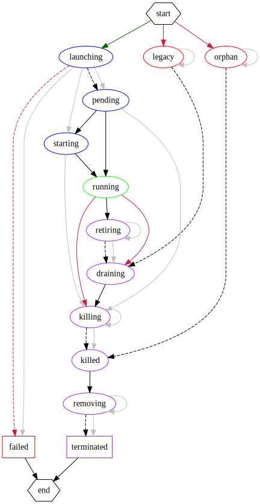

Agent Scheduler
===============

The heart of the plugin is the agent scheduler. This is the central piece of
plugin state, and it keeps track of cluster and agent state as the plugin runs.


## Aurora Clients

The scheduler maintains one open client for each configured Aurora URL.  Clients
communicate with the cluster using Thrift over HTTP.

Only one thread at a time may use each client, and any error will cause the
client to be closed as a precaution. Future calls will automatically open a new
client to the cluster.


## Cluster State

For each cluster, the plugin will check on the resource quota available to the
configured role. When considering whether to launch new agents, it will try to
avoid exceeding the quota. Operators should use the quota as a way of scaling
the amount of resources available to the agents.


## Agent State

Each agent goes through a sequence of states during its lifespan. The
scheduler's primary responsibility is to apply logic to the agents and manage
their state transitions in response to events.



See the [source file](agent-states.dot) for commentary on individual states and
transitions. This diagram can be regenerated from the source using graphviz:

```
$ dot -Tsvg < doc/agent-states.dot > doc/media/agent-states.svg
```
